# Shadow-Of-Chernobyl-Streaming-Integration

This repository serves as a guide for integrating streaming events into your **STALKER: Shadow Of Chernobyl** playthrough. By default, the integration spawns different enemies around the player when an event occurs, but you are free to modify the code to suit your purposes. The code provided serves as an easy-to-set-up solution or an entry point for creating further integrations and functionality—so you don't have to struggle like I did. Enjoy!

## Prerequisites

You will need to install/download the following software/tools to set up the integration as it currently exists.

### Required
- **STALKER: Shadow Of Chernobyl** – [Steam Page](https://store.steampowered.com/app/4500/STALKER_Shadow_of_Chernobyl/)
- An account with **StreamElements**  
  *(Note: You can modify `server.js` to work with StreamLabs, but this repository is built to work with StreamElements only.)*
- The latest version of **Node.js** – [download here](https://nodejs.org/en/download)
- The latest version of **Microsoft Visual Studio** (Visual Studio 2022 at the time of writing) – [download here](https://visualstudio.microsoft.com/)  
  **Note:** You must install the **Desktop C++ workload** during Visual Studio installation; otherwise, the compilation will fail.
- **Git** for downloading build dependencies for the OGSR engine – [download here](https://git-scm.com/downloads)

### Recommended
- A code editor of your choice (I personally like [VSCodium](https://vscodium.com/)) for editing your Node.js server file.

## Step 1: Downloading and Modifying the OGSR Engine

This is the main part of setting up the integration.

1. **Clone or download** the OGSR Engine repository from [here](https://github.com/OGSR/OGSR-Engine).
2. **Clone or download** this repository.
3. It is recommended to place both folders on your desktop.
4. Open the **OGSR-Engine** folder and run the **Update_DirectX_Components** file to install the necessary components.
   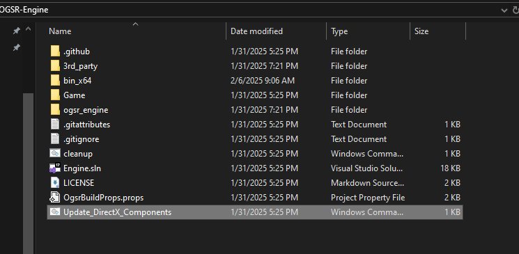
5. Open this repository's **code** folder and copy `MySocketServer.cpp`, `MySocketServer.hpp`, and `ActorNetwork.cpp`.
   - **Copy the three files circled below from this repo:**
     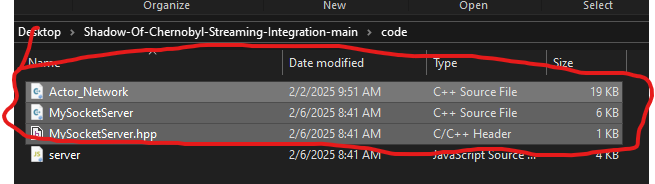
   - **Paste them into the OGSR Engine's `osgr_engine/xrGame` folder.**  
     If prompted to replace a file, confirm the replacement.
     
6. Go to the root of the OGSR folder and open the `Engine.sln` file.
   
7. Visual Studio will open. It should look like this:
   
8. In the right panel, click on the `xrGame` dropdown, right-click, and choose **Add → Existing Item**.
   
9. Select `MySocketServer.cpp` in the file dialog and click **Add**.
   
10. Confirm that `MySocketServer.cpp` is included in the project. Then, in the top menu, switch the build configuration from **Debug** to **Release** and click **Build → Build Solution**.
     
    
    
12. Allow Visual Studio to compile. The new engine executable will be in the `OGSR-Engine/bin_x64` folder.
    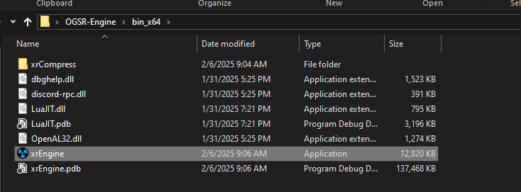
13. Next, in Steam, right-click on **STALKER: Shadow of Chernobyl** and select **Manage → Browse Local Files** (or locate the game folder manually if you're not using Steam).
     
    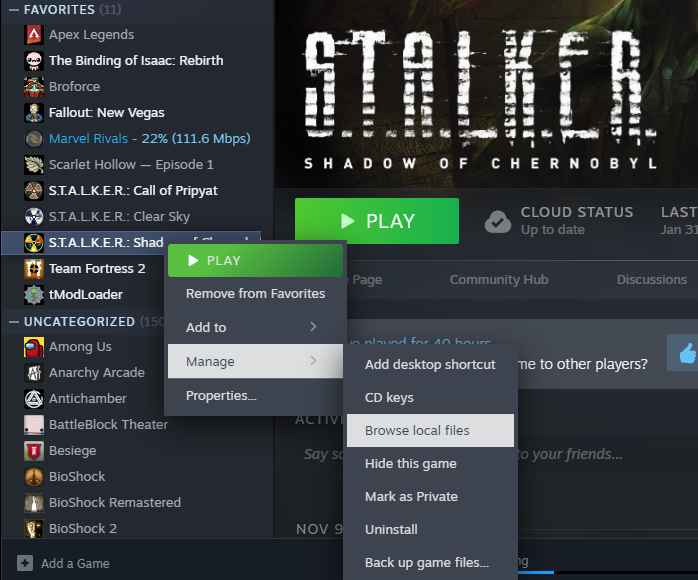
14. Drag and drop the new `xrEngine.exe` into the STALKER game folder, and do the same for the entire `OGSR-Engine/Resources_SoC_1.0006/gamedata` folder.
    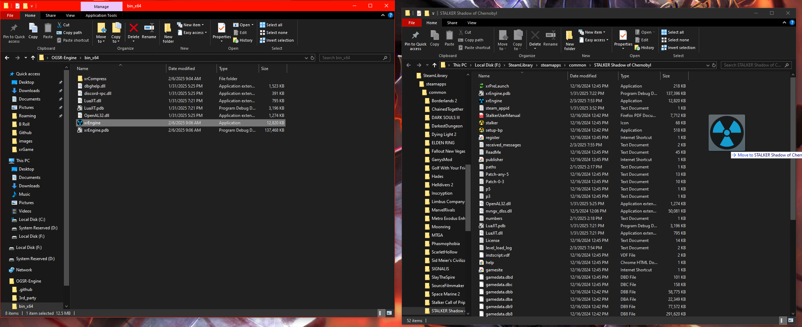
    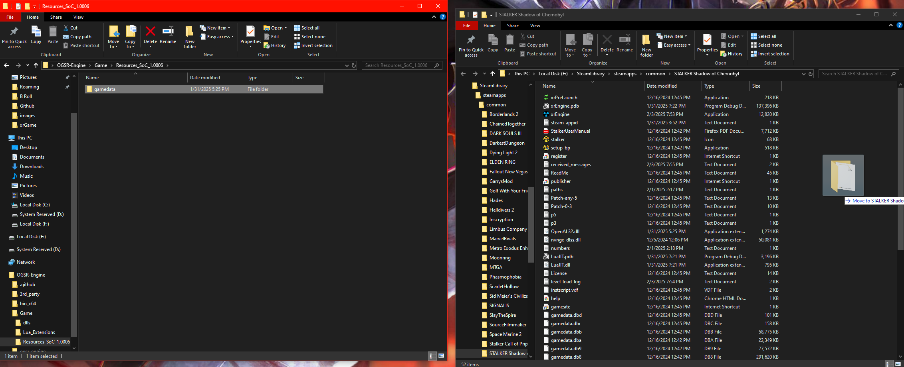
15. In the STALKER game folder, click on the new `xrEngine.exe` to start the game.

**Phew!** That was the toughest part, but congratulations—you’ve just added a custom modification to a game engine!

## Step 2: Setting Up and Modifying Your Node.js Server

1. Open the `server.js` file (located in this repository’s **code** folder) in your preferred code editor.
   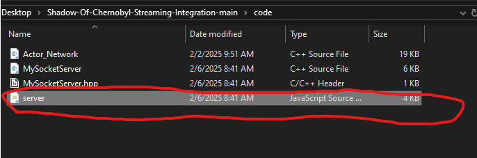
2. The file may display several error highlights (don’t worry, this is intended).
   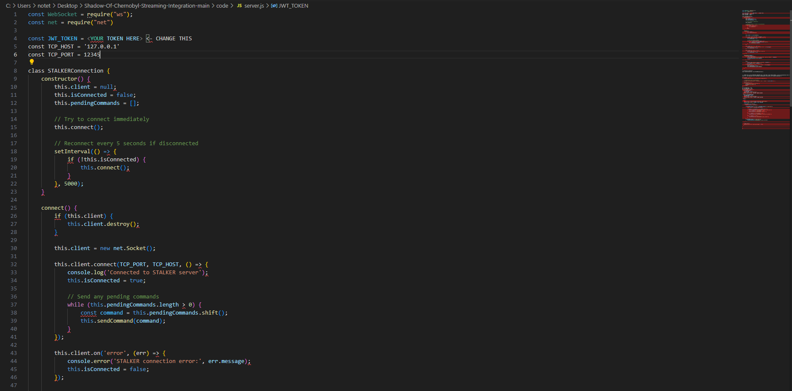
3. **Note:** If you use StreamLabs, you will need to modify `server.js` accordingly. This repository is currently set up for StreamElements. The process should be similar if you refer to the [StreamLabs Socket API documentation](https://dev.streamlabs.com/docs/socket-api) and use ChatGPT for assistance.
4. Log in to your StreamElements account (or sign up for one), navigate to [your dashboard](https://streamelements.com/dashboard/account/channels), and copy your **JWT Token**.  
   **WARNING:** Do not share this token with anyone—it grants control over your account!
   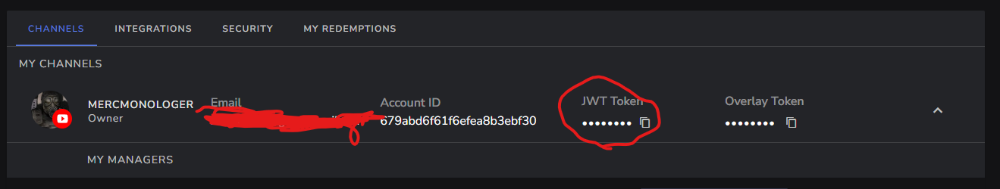
5. Paste the JWT token into `server.js` where indicated.
    
   
7. Open a terminal in the same folder as `server.js` and run: `node server.js`

You should see output similar to the following:
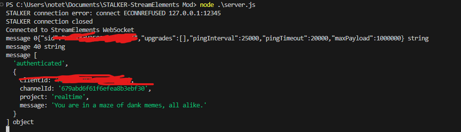
 
7. Do not worry if you see an `ECONNREFUSED` error; it is expected as the Shadow Of Chernobyl is not running at the moment.  
8. With the Node.js server running, launch **STALKER: Shadow of Chernobyl** using the modified `xrEngine.exe` and load a save. A connection should be established, as shown below:
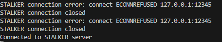

**And viola!** You now have a working integration with StreamElements—whenever someone subscribes or tips, an enemy will spawn.

Currently, the spawn events are configured as follows:

| Event/Tip Amount   | Enemy Spawned        |
|--------------------|----------------------|
| Subscribe          | Spawn 1 Snork        |
| Tip $1 up to $5    | Spawn 10 Tushkanos   |
| Tip $5 up to $10   | Spawn 3 Psuedodogs   |
| Tip $10 up to $15  | Spawn 5 Bloodsuckers |
| Tip $15 and above  | Spawn 3 Psuedogiants |

To change this configuration, modify both `server.js` and `MySocketServer.cpp`. **Any changes to the engine files require recompilation!**

## Additional Resources

For more information about modding **STALKER** and to learn the basics, refer to [this wiki](https://sdk.stalker-game.com/en/index.php?title=Your_first_modification).

Good luck and thanks for reading!

