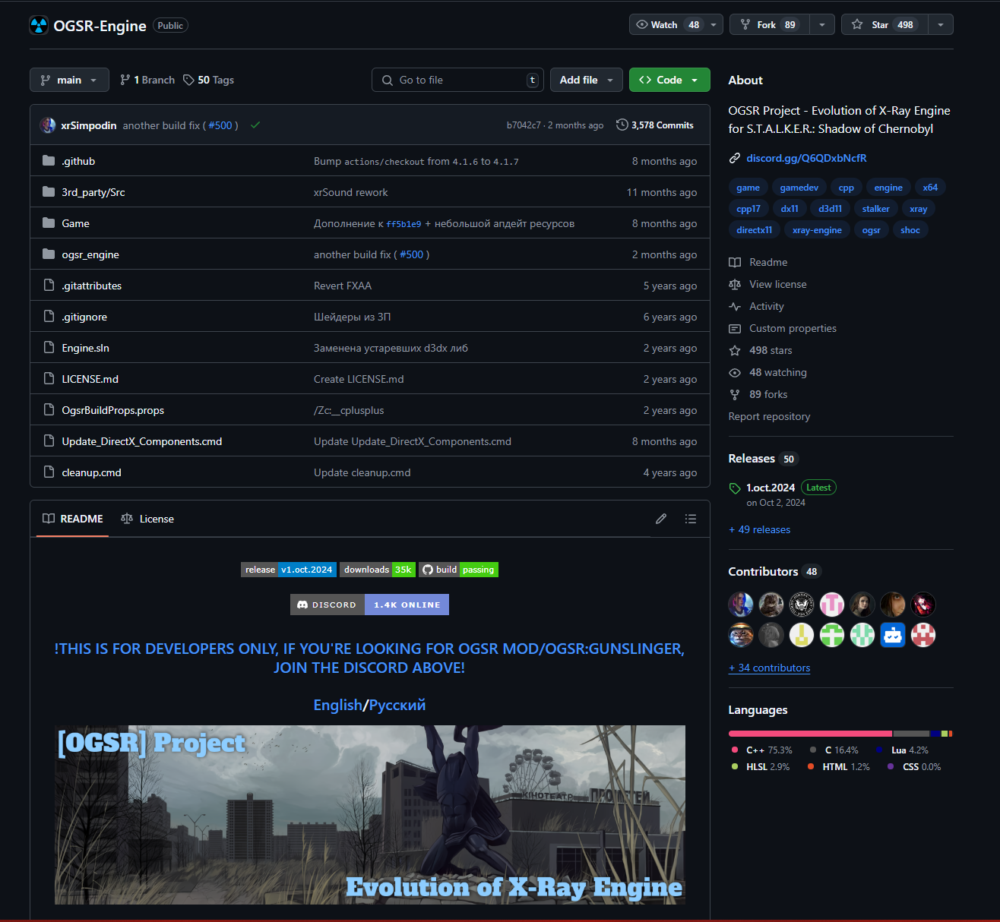

# Shadow-Of-Chernobyl-Streaming-Integration
This repo is meant as guide for anyone looking to add streaming events integration into their STALKER: Shadow Of Chernobyl playthrough. Currently the default is to just spawn in different enemies around the player chracter when an event occurs, but you are free to modify and use the code in any way you wish for your purposes. The code here acts as an easy to set up ready to go solution or as an entry point for them to create further integrations and functionality so they don't have to struggle like I did to figure out how to do this. So Enjoy.

<h1>Prerequisites</h1>
You will need to install/download the following pieces software/tools in order to successfully set up the integration as it currently exists
<h3>Required</h3>
 
<ul>
 <li>An account with either StreamLabs or StreamElements (I personally like StreamElements more but I'm not your dad ¯\_(ツ)_/¯)</li>
 <li>The latest version of Node.js: <a href="https://nodejs.org/en/download">download here</a> </li>
 <li>The latest version of Microsoft Visual Studio (Visual Studio 2022 at time of writing): <a href="https://visualstudio.microsoft.com/">download here</a> Note: You NEED to install the Desktop C++ workload set up when installing Visual Studio or else the compilation won't work</li>
</ul>
<h3>Reccommended</h3>
 
<ul>
  <li>A code editor of your choice (I personally like <a href="https://vscodium.com/">VSCodium</a>) to edit your node.js server file</li>
  <li>Git for easily cloning from this repo and the <a href="https://github.com/OGSR/OGSR-Engine"> OGSR repo </a> but downloading the zip works just fine
  </li>
</ul>

<h1>Step 1: Downloading and modifying the OGSR Engine</h1>

 
