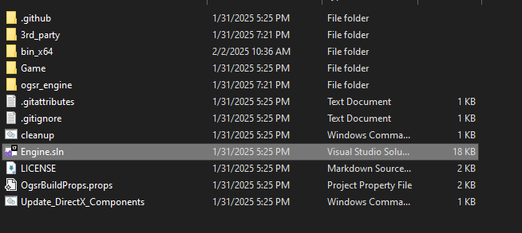
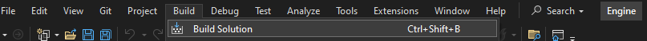

# Shadow-Of-Chernobyl-Streaming-Integration

This repo is meant as guide for anyone looking to add streaming events integration into their STALKER: Shadow Of Chernobyl playthrough. Currently the default is to just spawn in different enemies around the player chracter when an event occurs, but you are free to modify and use the code in any way you wish for your purposes. The code here acts as an easy to set up ready to go solution or as an entry point for them to create further integrations and functionality so they don't have to struggle like I did to figure out how to do this. So Enjoy.

<h1>Prerequisites</h1>
You will need to install/download the following pieces software/tools in order to successfully set up the integration as it currently exists
<h3>Required</h3>
 
<ul>
 <li>A copy of STALKER: Shadow Of Chernobyl: <a href="https://store.steampowered.com/app/4500/STALKER_Shadow_of_Chernobyl/">Steam Page</a></li>
 <li>An account with either StreamLabs or StreamElements (I personally like StreamElements more but I'm not your dad ¯\_(ツ)_/¯)</li>
 <li>The latest version of Node.js: <a href="https://nodejs.org/en/download">download here</a> </li>
 <li>The latest version of Microsoft Visual Studio (Visual Studio 2022 at time of writing): <a href="https://visualstudio.microsoft.com/">download here</a> Note: You NEED to install the Desktop C++ workload set up when installing Visual Studio or else the compilation won't work</li>
 <li>Git for downloading build dependencies for the OGSR engine: <a href="https://git-scm.com/downloads">download here</a></li>
</ul>
<h3>Reccommended</h3>
 
<ul>
  <li>A code editor of your choice (I personally like <a href="https://vscodium.com/">VSCodium</a>) to edit your node.js server file</li>

</ul>

<h1>Step 1: Downloading and modifying the OGSR Engine</h1>
 

 

This is the main meat and potatoes of getting this set up

 
<ol>
  <li>Clone or download the repository at this <a href="https://github.com/OGSR/OGSR-Engine">location</a></li>
  <li>Clone or download this repository</li>
  <li>I reccommend that you put both folders on your desktop</li>
  <li>Open up this repository folder, go to code and copy MySocketServer.cpp and MySocketServer.hpp into the OGSR Engine folder shown below.
    
   <h2>Copy the two files circled below from this repo</h2>
   
    
   <h2>Paste them into the OGSR Engine/osgr_engine/xrGame folder shown below</h2>
   
    
  <li>Go back to the root of the OGSR folder and click on the Engine.sln file shown below</li> 
   
  
   
 <li>Visual Studio should open up and look like this</li>
   
  
   
 <li>On the right bar click on the xrGame drop down and then right click and click add->Existing Item</li>
    
  
   
  <li>Select MySocketServer.cpp in the file dialog and click add</li>
    
  
   
  <li>Confirm MySocketServer.cpp is included and then go to the to bar and click build->build solution</li>
    
  
   
  
   
  
 
</ol>

 
